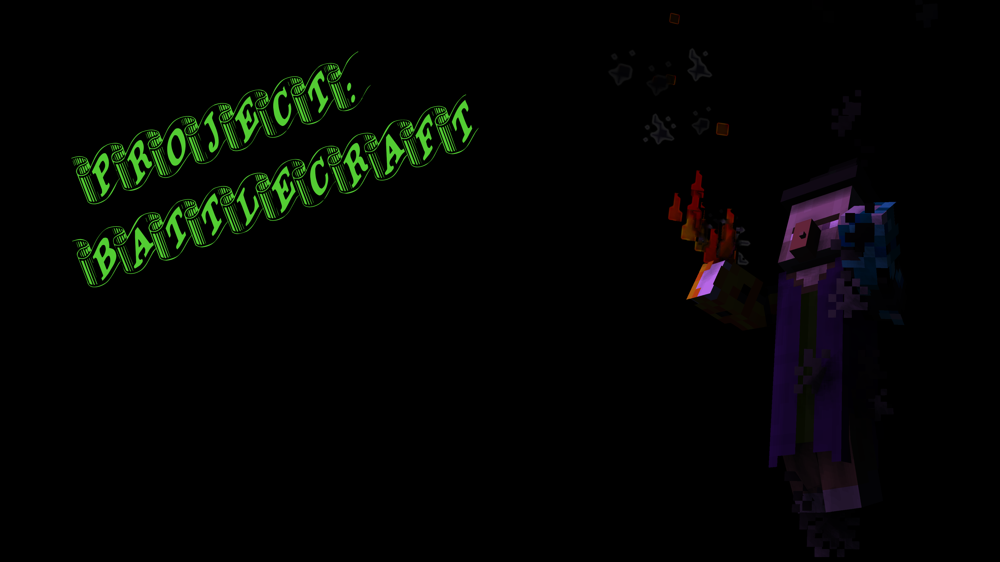

# Project: BattleCraft
Ultimate Endless Action FPS Arena Game

Project Developement Description: (German)

#### Idee: Konzept von Overwatch in Endless Mode(GunGame like)
- Hauptwaffe auf slot 6
- Attacks mit Cooldown auf Slot 0-2
- Special Attack auf Slot 4
- Passive Booster auf Slot 8
  		
#### Attacken kosten Mana
- Anzeige per Actionbar
- 1 Mana pro Sekunde wird regeneriert (Standartmäßig)
- Design der Manabar: 

#### LevelSystem( Level & XP von Minecraft übernehmen )
  
#### Attacken per Skillbaum upgrade und erweiterbar
  		
  
#### Cooldowns:
- Leichte Attacken ( 1-10 Sekunden )
- Mittlere Attacken ( 8-20 Sekunden )
- Starke Attacken ( 12-30 Sekunden )
- Special Attacken ( 45 - 180 Sekunden )	
  
  
#### Vorteile der Endless Mode:
- Nur 1 Server benötigt.
- Kein CloudSystem benötigt.
- Dauerhafter Spielspaß (Keine Todeszeiten/Zuschauer/ Kein Warten auf Ende der Runde)
- Kontinuierliche Upgrades (Kein Reset nach Verlassen)
  		
  
#### Beispiel zu leichten Attacken:
- Schuss -> Ein Pfeil der perfekt in richtung des nähsten Gegners schießt ( 2 Sekunden Cooldown, 15 Mana )
  
#### Beispiel für mittlere Attacken:
- Fireball -> Schleudert einen Feuerball der dem ersten Getroffenem Gegner 5 Herzen Schaden macht( 15 Sekunden Cooldown, 40 Mana )

#### Beispiel für Starke Attacken:
- Granate -> Wirft eine Granate die starken Flächenschaden macht ( 25 Sekunden Cooldown, 45 Mana )
  
#### Beispiel für Special Attacken:
- Napalm Abwurf -> Lässt in einem Großen Bereich Feuerbomben vom Himmel Regenen die großflächig viel Schaden machen und Gegner anzünden können ( 130 Sekunden Cooldown, 80 Mana )
  
#### Beispiel für Passive Booster
- FastMana -> Stellt pro Sekunden +3 Mana wiederher

#### Geld/Economy:
- Währung: Gallonen
- Eintauschbar gegen neue Rüstungen und Waffen
- Gallonen per Kill kommt auf Level des Gegners an:
  - Gegner 20 Level oder mehr unter eigenem Level: Nichts
  - Gegner -19 bis +19 Level: %Anteil des Geldes des Gegners (zB: 5% des Gegners -> Gegner(100 Gallonen) -> Reward(5 Gallonen))
  - Gegner 20+ Level: Sehr großer Anteil des Geldes (zB: 45%-75% des Geldes)

#### Special Events (Optional):
- zB: Zombiebefallenes Fort (RPG Style / PvE)
  
  @author CoasterFreak (Start: 19.05.2017)
  
  
  
 
 
### Screenshots
Day One (19.05.2017):

